A seguir, apresento uma série de exercícios didáticos para iniciantes em Python. Cada exercício inclui:

1. **Explicação Teórica Básica**  
2. **Passo a Passo do Algoritmo**  
3. **Fluxograma em Mermaid (Markdown)**  
4. **Código Python Comentado**  
5. **Exemplo de Entrada/Saída**

Você pode visualizar os fluxogramas diretamente em um editor que suporte Mermaid, como alguns renderizadores do GitHub, VS Code (com extensão Mermaid Preview) ou outras ferramentas compatíveis.

---

## Exercício 1: Hello, World!

### 1. Explicação Teórica
- **Conceitos**:  
  - Sintaxe básica do Python.  
  - Função `print()` para exibir mensagens.

### 2. Passo a Passo
1. Iniciar o programa.  
2. Exibir a mensagem 'Hello, World!'.  
3. Encerrar o programa.

### 3. Fluxograma (Mermaid)
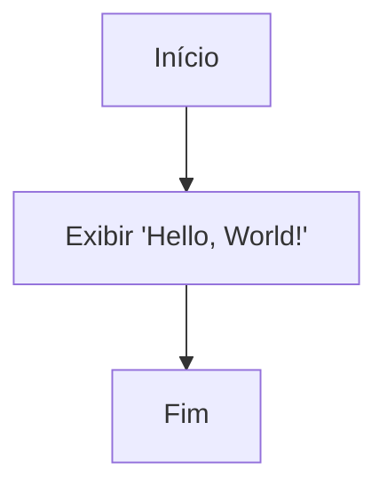

### 4. Código Python
```python
# Exercício 1: Hello, World!
# Exibe a mensagem 'Hello, World!' na tela

print('Hello, World!')  # Imprime a mensagem na saída padrão
```

### 5. Exemplo de Saída
```
Hello, World!
```

---

## Exercício 2: Entrada de Usuário

### 1. Explicação Teórica
- **Conceitos**:  
  - Receber dados com `input()`.  
  - Armazenar dados em variáveis e utilizar `print()`.

### 2. Passo a Passo
1. Pedir o nome do usuário.  
2. Ler e armazenar o nome.  
3. Exibir uma saudação personalizada.

### 3. Fluxograma (Mermaid)
```mermaid
graph TD
  A[Início] --> B[Pedir 'Digite seu nome:']
  B --> C[Ler o nome e armazenar]
  C --> D[Exibir 'Olá, {nome}!']
  D --> E[Fim]
```

### 4. Código Python
```python
# Exercício 2: Entrada de Usuário
# Lê o nome do usuário e exibe uma saudação personalizada

nome = input('Digite seu nome: ')  # Recebe o nome do usuário
print(f'Olá, {nome}!')            # Exibe a saudação com o nome informado
```

### 5. Exemplo de Entrada/Saída
- **Entrada**: Ana  
- **Saída**: Olá, Ana!

---

## Exercício 3: Calculadora Simples

### 1. Explicação Teórica
- **Conceitos**:  
  - Conversão de entrada para números (`float()`).  
  - Operações matemáticas básicas.  
  - Uso de condicionais para selecionar a operação.

### 2. Passo a Passo
1. Solicitar dois números.  
2. Solicitar a operação (+, -, *, /).  
3. Verificar a operação escolhida.  
4. Calcular e exibir o resultado.

### 3. Fluxograma (Mermaid)
```mermaid
graph TD
  A[Início] --> B[Pedir primeiro número]
  B --> C[Pedir segundo número]
  C --> D[Pedir operador (+, -, *, /)]
  D --> E{Qual operador?}
  E -->|+| F[Calcular soma]
  E -->|-| G[Calcular subtração]
  E -->|*| H[Calcular multiplicação]
  E -->|/| I[Verificar divisor != 0 e dividir]
  F --> J[Exibir resultado]
  G --> J
  H --> J
  I --> J
  J --> K[Fim]
```

### 4. Código Python
```python
# Exercício 3: Calculadora Simples
# Realiza operações básicas com dois números, com base no operador informado

num1 = float(input('Digite o primeiro número: '))  # Lê o primeiro número
num2 = float(input('Digite o segundo número: '))   # Lê o segundo número
operacao = input('Digite a operação (+, -, *, /): ')  # Lê o operador desejado

if operacao == '+':
    resultado = num1 + num2  # Soma
elif operacao == '-':
    resultado = num1 - num2  # Subtração
elif operacao == '*':
    resultado = num1 * num2  # Multiplicação
elif operacao == '/':
    if num2 != 0:
        resultado = num1 / num2  # Divisão segura
    else:
        resultado = 'Erro: Divisão por zero'
else:
    resultado = 'Operação inválida'

print(f'O resultado é: {resultado}')  # Exibe o resultado
```

### 5. Exemplo de Entrada/Saída
- **Entrada**:  
  Número 1: 10, Número 2: 5, Operador: /  
- **Saída**:  
  O resultado é: 2.0

---

## Exercício 4: Área do Retângulo

### 1. Explicação Teórica
- **Conceitos**:  
  - Uso de variáveis.  
  - Operação de multiplicação para calcular área.

### 2. Passo a Passo
1. Solicitar a largura.  
2. Solicitar a altura.  
3. Calcular a área (largura * altura).  
4. Exibir a área.

### 3. Fluxograma (Mermaid)
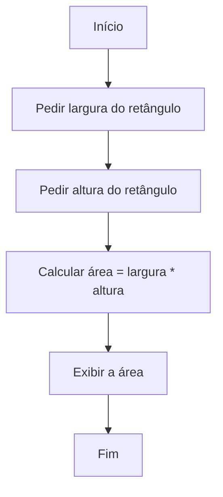

### 4. Código Python
```python
# Exercício 4: Área do Retângulo
# Calcula a área de um retângulo com base na largura e altura informadas

largura = float(input('Digite a largura do retângulo: '))  # Lê a largura
altura = float(input('Digite a altura do retângulo: '))      # Lê a altura

area = largura * altura  # Calcula a área
print(f'A área do retângulo é: {area}')  # Exibe a área
```

### 5. Exemplo de Entrada/Saída
- **Entrada**:  
  Largura: 5, Altura: 3  
- **Saída**:  
  A área do retângulo é: 15.0

---

## Exercício 5: Verificação de Paridade

### 1. Explicação Teórica
- **Conceitos**:  
  - Operador módulo (%) para verificar restos.  
  - Estrutura condicional `if/else`.

### 2. Passo a Passo
1. Solicitar um número.  
2. Calcular número % 2.  
3. Se o resto for 0, o número é par; senão, ímpar.  
4. Exibir o resultado.

### 3. Fluxograma (Mermaid)
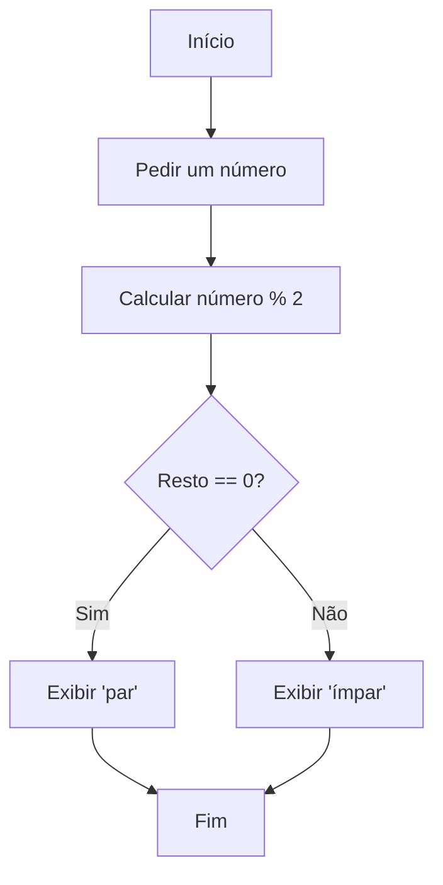

### 4. Código Python
```python
# Exercício 5: Verificação de Paridade
# Determina se um número é par ou ímpar com base no resto da divisão por 2

numero = int(input('Digite um número: '))  # Lê o número do usuário

if numero % 2 == 0:
    print(f'{numero} é um número par')
else:
    print(f'{numero} é um número ímpar')
```

### 5. Exemplo de Saída
- **Entrada**: 7  
- **Saída**: 7 é um número ímpar

---

## Exercício 6: Calculadora de Notas

### 1. Explicação Teórica
- **Conceitos**:  
  - Leitura de múltiplos valores.  
  - Cálculo de média aritmética.  
  - Estruturas condicionais para aprovação (média ≥ 7).

### 2. Passo a Passo
1. Solicitar três notas.  
2. Calcular a média: (nota1 + nota2 + nota3) / 3.  
3. Se a média for ≥ 7, aluno aprovado; senão, reprovado.  
4. Exibir o resultado.

### 3. Fluxograma (Mermaid)
```mermaid
graph TD
  A[Início] --> B[Pedir três notas]
  B --> C[Calcular média = (nota1+nota2+nota3)/3]
  C --> D{Média >= 7?}
  D -->|Sim| E[Exibir 'Aluno aprovado']
  D -->|Não| F[Exibir 'Aluno reprovado']
  E --> G[Fim]
  F --> G
```

### 4. Código Python
```python
# Exercício 6: Calculadora de Notas
# Calcula a média de três notas e verifica se o aluno foi aprovado (média >= 7)

nota1 = float(input('Digite a primeira nota: '))
nota2 = float(input('Digite a segunda nota: '))
nota3 = float(input('Digite a terceira nota: '))

media = (nota1 + nota2 + nota3) / 3  # Calcula a média

if media >= 7:
    print(f'Aluno aprovado com média {media:.2f}')
else:
    print(f'Aluno reprovado com média {media:.2f}')
```

### 5. Exemplo de Entrada/Saída
- **Entrada**: Notas: 8, 7, 9  
- **Saída**: Aluno aprovado com média 8.00

---

## Exercício 7: Imprimir Números de 1 a 10

### 1. Explicação Teórica
- **Conceitos**:  
  - Uso de laço de repetição `for`.  
  - Função `range()` para gerar sequências.

### 2. Passo a Passo
1. Iterar de 1 até 10.  
2. Imprimir cada número.

### 3. Fluxograma (Mermaid)
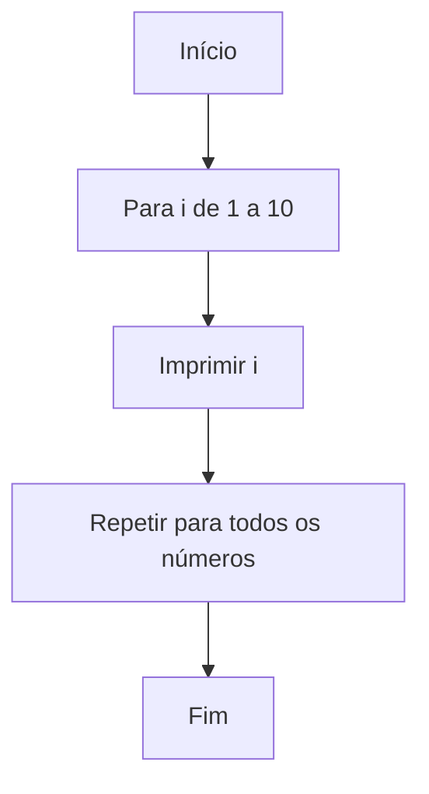

### 4. Código Python
```python
# Exercício 7: Imprimir Números de 1 a 10
# Imprime os números de 1 a 10 utilizando um loop for

for i in range(1, 11):  # Itera de 1 a 10
    print(i)
```

### 5. Exemplo de Saída
```
1
2
3
4
5
6
7
8
9
10
```

---

## Exercício 8: Soma de Números

### 1. Explicação Teórica
- **Conceitos**:  
  - Uso de laços para acumulação.  
  - Variáveis para armazenar soma.

### 2. Passo a Passo
1. Solicitar um número N.  
2. Inicializar soma = 0.  
3. Iterar de 1 até N, acumulando a soma.  
4. Exibir o resultado.

### 3. Fluxograma (Mermaid)
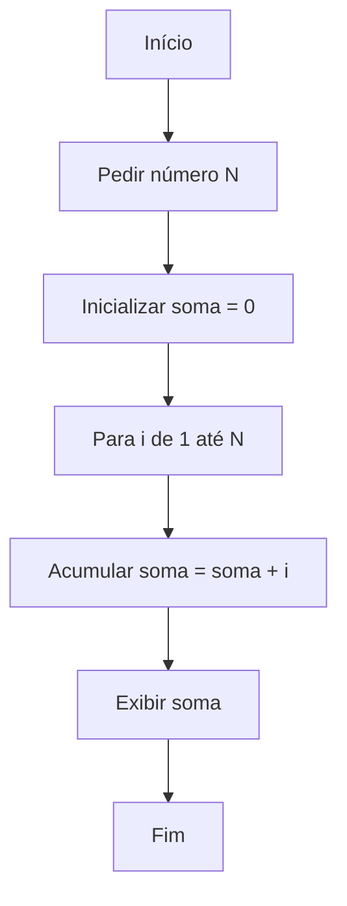

### 4. Código Python
```python
# Exercício 8: Soma de Números
# Soma todos os números de 1 até N fornecido pelo usuário

N = int(input('Digite um número N: '))
soma = 0

for i in range(1, N + 1):
    soma += i

print(f'A soma dos números de 1 a {N} é: {soma}')
```

### 5. Exemplo de Entrada/Saída
- **Entrada**: 5  
- **Saída**: A soma dos números de 1 a 5 é: 15

---

## Exercício 9: Fatorial de um Número

### 1. Explicação Teórica
- **Conceitos**:  
  - Criação de funções.  
  - Laços para cálculo repetitivo.  
  - Definição de fatorial: n! = 1 × 2 × ... × n.

### 2. Passo a Passo
1. Definir uma função de fatorial.  
2. Solicitar um número.  
3. Inicializar fatorial = 1.  
4. Multiplicar fatorial pelos números de 1 até N.  
5. Exibir o resultado.

### 3. Fluxograma (Mermaid)
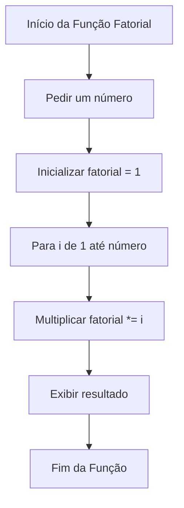

### 4. Código Python
```python
# Exercício 9: Fatorial de um Número
# Calcula o fatorial de um número fornecido pelo usuário

def fatorial():
    numero = int(input('Digite um número: '))
    fatorial = 1
    for i in range(1, numero + 1):
        fatorial *= i
    print(f'O fatorial de {numero} é: {fatorial}')

fatorial()  # Executa a função
```

### 5. Exemplo de Entrada/Saída
- **Entrada**: 5  
- **Saída**: O fatorial de 5 é: 120

---

## Exercício 10: Verificação de Palíndromo

### 1. Explicação Teórica
- **Conceitos**:  
  - Manipulação de strings.  
  - Remoção de espaços e padronização (minúsculas).  
  - Uso de slicing para inverter strings.

### 2. Passo a Passo
1. Definir uma função para verificar palíndromos.  
2. Solicitar uma palavra ou frase.  
3. Processar a string removendo espaços/pontuações e convertendo para minúsculas.  
4. Inverter a string.  
5. Comparar e exibir o resultado.

### 3. Fluxograma (Mermaid)
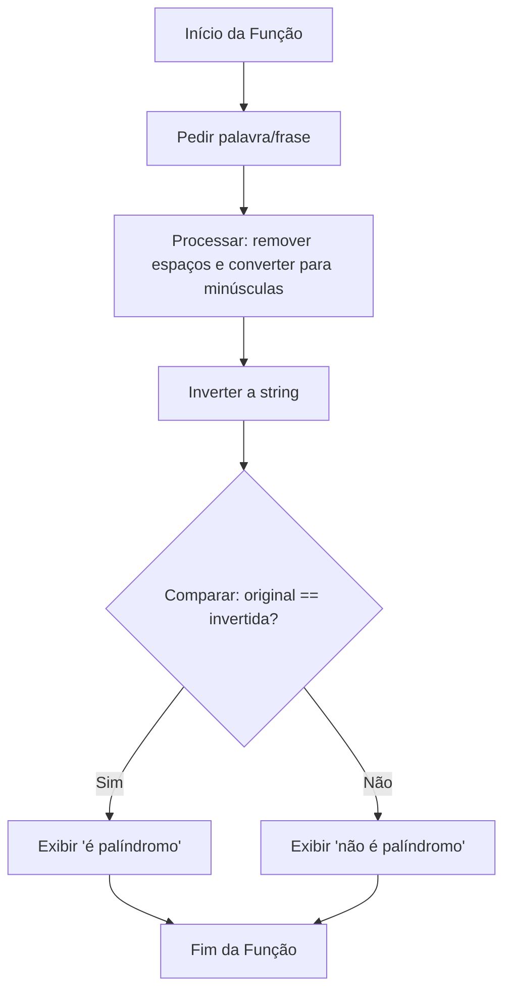

### 4. Código Python
```python
# Exercício 10: Verificação de Palíndromo
# Determina se uma palavra ou frase é um palíndromo

def eh_palindromo():
    texto = input('Digite uma palavra ou frase: ')
    texto_processado = ''.join(char for char in texto if char.isalnum()).lower()
    texto_invertido = texto_processado[::-1]
    if texto_processado == texto_invertido:
        print(f''{texto}' é um palíndromo')
    else:
        print(f''{texto}' não é um palíndromo')

eh_palindromo()
```

### 5. Exemplo de Entrada/Saída
- **Entrada**: Ame a ema  
- **Saída**: 'Ame a ema' é um palíndromo

---

## Exercício 11: Média de uma Lista

### 1. Explicação Teórica
- **Conceitos**:  
  - Uso de listas para armazenar dados.  
  - Funções `sum()` e `len()` para calcular a média.

### 2. Passo a Passo
1. Solicitar ao usuário uma lista de números, separados por espaço.  
2. Converter a entrada em uma lista numérica.  
3. Calcular a média: soma / quantidade.  
4. Exibir a média.

### 3. Fluxograma (Mermaid)
```mermaid
graph TD
  A[Início] --> B[Pedir lista de números (separados por espaço)]
  B --> C[Converter entrada em lista de números]
  C --> D[Calcular média = sum(lista)/len(lista)]
  D --> E[Exibir a média]
  E --> F[Fim]
```

### 4. Código Python
```python
# Exercício 11: Média de uma Lista
# Calcula a média dos números inseridos pelo usuário

entrada = input('Digite uma lista de números separados por espaço: ')
numeros = [float(num) for num in entrada.split()]
media = sum(numeros) / len(numeros)
print(f'A média dos números é: {media}')
```

### 5. Exemplo de Entrada/Saída
- **Entrada**: 5 8 10  
- **Saída**: A média dos números é: 7.67

---

## Exercício 12: Ordenação de Lista

### 1. Explicação Teórica
- **Conceitos**:  
  - Manipulação de listas.  
  - Uso do método `.sort()` para ordenar.

### 2. Passo a Passo
1. Solicitar ao usuário uma lista de números.  
2. Converter a entrada em lista numérica.  
3. Ordenar a lista.  
4. Exibir a lista ordenada.

### 3. Fluxograma (Mermaid)
```mermaid
graph TD
  A[Início] --> B[Pedir lista de números]
  B --> C[Converter entrada para lista numérica]
  C --> D[Ordenar a lista usando .sort()]
  D --> E[Exibir lista ordenada]
  E --> F[Fim]
```

### 4. Código Python
```python
# Exercício 12: Ordenação de Lista
# Ordena uma lista de números em ordem crescente

entrada = input('Digite uma lista de números separados por espaço: ')
numeros = [float(num) for num in entrada.split()]
numeros.sort()
print(f'Lista ordenada: {numeros}')
```

### 5. Exemplo de Entrada/Saída
- **Entrada**: 7 3 5 2  
- **Saída**: Lista ordenada: [2.0, 3.0, 5.0, 7.0]

---

## Exercício 13: Contagem de Palavras

### 1. Explicação Teórica
- **Conceitos**:  
  - Manipulação de strings e listas.  
  - Uso de dicionários para contar ocorrências.

### 2. Passo a Passo
1. Solicitar uma frase.  
2. Dividir a frase em palavras.  
3. Contar cada ocorrência de cada palavra.  
4. Exibir a contagem.

### 3. Fluxograma (Mermaid)
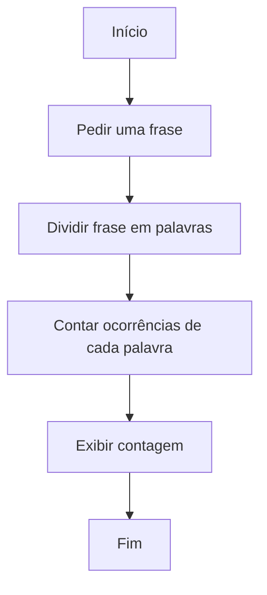

### 4. Código Python
```python
# Exercício 13: Contagem de Palavras
# Conta quantas vezes cada palavra aparece na frase

frase = input('Digite uma frase: ')
palavras = frase.split()
contagem = {}

for palavra in palavras:
    if palavra in contagem:
        contagem[palavra] += 1
    else:
        contagem[palavra] = 1

print('Contagem de palavras:', contagem)
```

### 5. Exemplo de Entrada/Saída
- **Entrada**: 'isto é um teste e isto é simples'  
- **Saída**: Contagem de palavras: {'isto': 2, 'é': 2, 'um': 1, 'teste': 1, 'e': 1, 'simples': 1}

---

## Exercício 14: Conjuntos de Números

### 1. Explicação Teórica
- **Conceitos**:  
  - Uso de conjuntos (`set`) no Python.  
  - Operações de união e interseção.

### 2. Passo a Passo
1. Solicitar dois conjuntos de números (separados por espaço).  
2. Converter cada entrada em um conjunto numérico.  
3. Calcular a união e a interseção.  
4. Exibir os resultados.

### 3. Fluxograma (Mermaid)
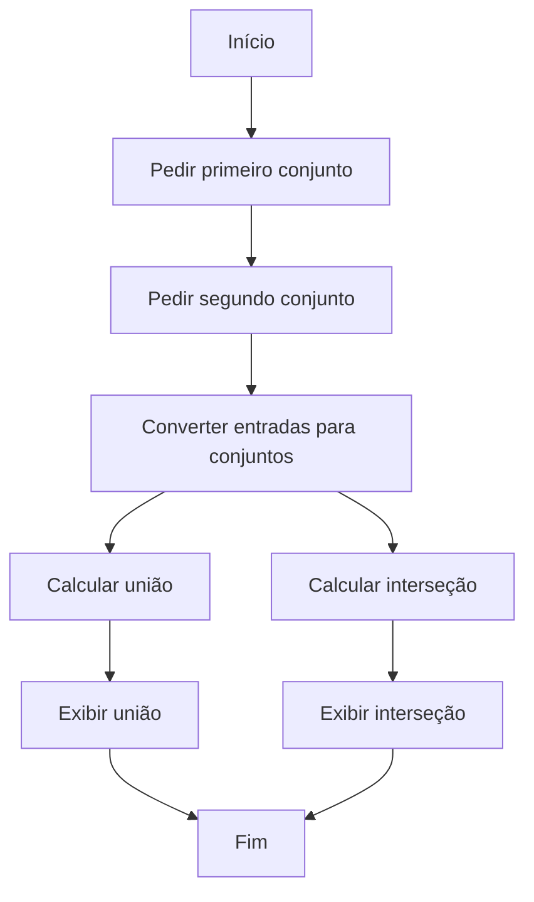

### 4. Código Python
```python
# Exercício 14: Conjuntos de Números
# Calcula a união e a interseção de dois conjuntos fornecidos pelo usuário

entrada1 = input('Digite o primeiro conjunto de números separados por espaço: ')
conjunto1 = set(map(int, entrada1.split()))

entrada2 = input('Digite o segundo conjunto de números separados por espaço: ')
conjunto2 = set(map(int, entrada2.split()))

uniao = conjunto1.union(conjunto2)
intersecao = conjunto1.intersection(conjunto2)

print(f'União: {uniao}')
print(f'Interseção: {intersecao}')
```

### 5. Exemplo de Entrada/Saída
- **Entrada**:  
  Conjunto 1: 1 2 3 4  
  Conjunto 2: 3 4 5 6  
- **Saída**:  
  União: {1, 2, 3, 4, 5, 6}  
  Interseção: {3, 4}

---

## Exercício 15: Leitura de Arquivos

### 1. Explicação Teórica
- **Conceitos**:  
  - Abertura e leitura de arquivos.  
  - Uso do bloco `with` para gerenciamento automático.

### 2. Passo a Passo
1. Solicitar o nome do arquivo.  
2. Abrir o arquivo em modo leitura.  
3. Ler e exibir o conteúdo.  
4. Encerrar (com `with` o fechamento ocorre automaticamente).

### 3. Fluxograma (Mermaid)
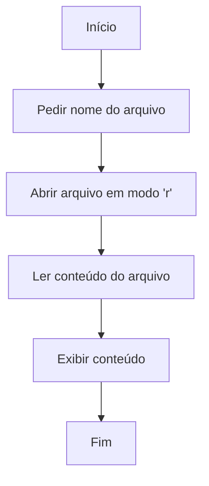

### 4. Código Python
```python
# Exercício 15: Leitura de Arquivos
# Lê e exibe o conteúdo de um arquivo de texto informado pelo usuário

nome_arquivo = input('Digite o nome do arquivo a ser lido: ')

with open(nome_arquivo, 'r', encoding='utf-8') as arquivo:
    conteudo = arquivo.read()

print('Conteúdo do arquivo:')
print(conteudo)
```

### 5. Exemplo de Entrada/Saída
- **Entrada**: Arquivo 'exemplo.txt' contendo 'Olá, Python!'  
- **Saída**:  
  Conteúdo do arquivo:  
  Olá, Python!

---

## Exercício 16: Escrita de Arquivos

### 1. Explicação Teórica
- **Conceitos**:  
  - Abertura e escrita em arquivos.  
  - Uso do modo 'w' para criar ou sobrescrever arquivos.

### 2. Passo a Passo
1. Solicitar ao usuário um texto.  
2. Solicitar o nome do arquivo.  
3. Abrir o arquivo em modo escrita.  
4. Escrever o texto nele.  
5. Informar que o arquivo foi salvo.

### 3. Fluxograma (Mermaid)
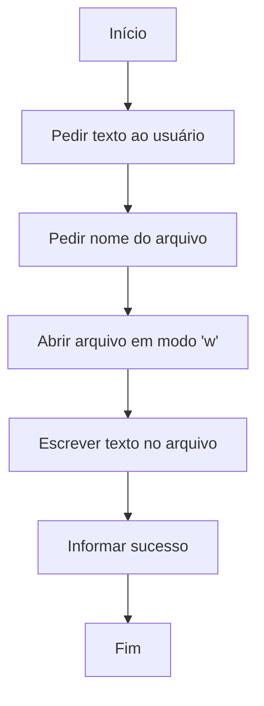

### 4. Código Python
```python
# Exercício 16: Escrita de Arquivos
# Solicita um texto e salva-o em um arquivo

texto_para_salvar = input('Digite o texto a ser salvo no arquivo: ')
nome_arquivo = input('Digite o nome do arquivo para salvar (ex: resultado.txt): ')

with open(nome_arquivo, 'w', encoding='utf-8') as arquivo:
    arquivo.write(texto_para_salvar)

print(f'O arquivo '{nome_arquivo}' foi salvo com sucesso!')
```

### 5. Exemplo de Entrada/Saída
- **Entrada**:  
  Texto: 'Aprendendo Python é divertido!'  
  Nome do arquivo: 'minha_frase.txt'  
- **Saída**:  
  O arquivo 'minha_frase.txt' foi salvo com sucesso!

---

### Considerações Finais

- **Revisão e Experimentação**:  
  Incentive a modificação do código e a exploração de diferentes entradas para entender como as mudanças afetam o resultado.

- **Ambiente Interativo**:  
  Utilize Jupyter Notebook ou outro ambiente interativo para testar os códigos.

- **Visualização**:  
  Os diagramas Mermaid ajudam a visualizar a lógica dos algoritmos, facilitando a compreensão dos fluxos de execução.

Com essa coleção de exercícios e seus fluxogramas em Mermaid, os iniciantes terão uma abordagem visual e prática para aprender os conceitos básicos de Python. Experimente, modifique e divirta-se programando!
